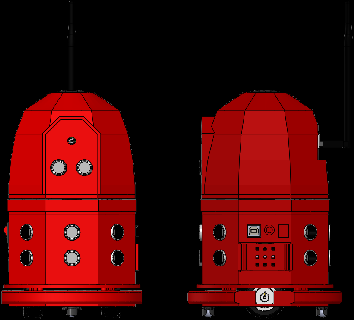
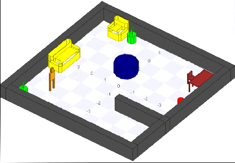

## Project description

Most robot programming environment to teach programming for kids and young people are highly visual, 
with drag and drop features. Thus, these interfaces can not be used by blind people or people with a 
severe visual impairment. The goal of this project it to propose a new assitive robot programming 
environment that can be used by blind people. In addition to the visual feedback normally provided by 
ordinary robot programming environment, the proposed system also provides sound and vibration feedback 
to the user.

The same system can also be used by blind users to learn and practice about orientation and mobility 
skills in a given floorplan in reduced scale. The user can practice how to move in a certain environment 
in reduced scale by using a simulated or a real robot. This way, when the user goes to the actual environment 
with the same floorplan, he/she will be able to remember the floorplan and move with more autonomy. 

   

---

| | | | |
| --- | --- | --- | --- |
|  |   |  |  |

### Goals

 - Goal 1: provide an environment (hardware and software) to teach robot programming for blind people
 - Goal 2: provide a tool to practive and improve the orientation and mobility skills of blind people

### Milestones

 - Milestone 1: Build the robot hardware prototype (electronics and 3D models)
 

## People

### Coordinators

 - Alexandre Amory, PUCRS.
 - [Isabel Harb Manssour](http://lattes.cnpq.br/4904489502853690)
 - [Marcia Borba Campos](http://lattes.cnpq.br/3266082770151361)

### Academic Collaborators

 - ...

### Students

 - Juliana Damasio, Master student on Computer Science/PUCRS, advised by Marcia Campos, role: usability test, bibliography survey, tests with users.
 - Augusto Cezar Peschke Bergamin, undergraduate student on Computer engineering/PUCRS, advised by Alexandre Amory, role: GoDonnie parser, Player/Stage models.
 - Guilherme Henrique Marculino Marques, undergraduate student on Computer engineering/PUCRS, advised by Alexandre Amory, role: 3D models, electronics, Arduino and Raspberry Pi programming,  Player device drivers.
 - Camila Kolling dos Reis, undergraduate student on Computer engineering/PUCRS, advised by Marcia Campos, role: usability tests.
 - Henry Nunes, undergraduate student on Computer Science/PUCRS, advised by Marcia Campos, role: usability tests.
 - Joice Marek, undergraduate student on Computer Science/PUCRS, advised by Isabel Manssour, role: computer vision, visual odometry.
 - Daniel Centeno Einloft, undergraduate student on Computer Science/PUCRS, advised by Isabel Manssour, role: computer vision, blob finder, Player driver.

## Funding

 - **2017**: [Chamada CNPq/MCTIC/SECIS Nº 20/2016 - TECNOLOGIA ASSISTIVA](http://resultado.cnpq.br/2914092840905117), BPA/PECDES
 - **2016**: Edital Interno FACIN, BPA/PECDES
 - **2015**: Edital Interno FACIN, BPA/PECDES
 - **2014**: Edital Interno FACIN, BPA/PECDES

## Papers and Reports

 - title and link. full bibio data is already available at ...

## Repositories

 - [Donnie's software enviroment](https://github.com/lsa-pucrs/donnie-assistive-robot-sw)
 - [Donnie's hardware design](https://github.com/lsa-pucrs/donnie-assistive-robot-hw)
 - [Donnie's 3D models for printing](https://github.com/lsa-pucrs/donnie-assistive-robot-3d)

## Main Resources

### Hardware
 
 - Raspberry Pi 2
 - Arduino Mega
 - Speakers
 - Vibration motors
 - Tacticle marks (3D printed)

### Software

 - Player middleware
 - Stage simulator
 - OpenCV
 - Arduino programming
 - Text to Speech

## Media 

videos and photos.

