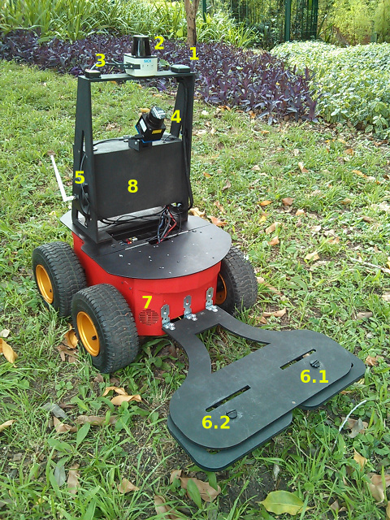

## Project description

The LSA's goal in the [HRATC2017](http://inf.ufrgs.br/hratc2017/HRATC2017/Welcome.html) competition is to provide the robot hardware, including the metal detector.

| | | |
| --- | --- | --- |
|  |   |  |
|  |   |  |

### Goals

 - Goal 1: provide the robot hardware. 100%.
 - Goal 2: provide the metal detector. 100%.
 - Goal 3: integrate with ROS-based environment. 100%.
 
### Milestones

 - Milestone 1: brief description; status (%)

## People

### Coordinator

 - Alexandre Amory, PUCRS.

### Academic Collaborators

 - [prof. Dr Edson Prestes](http://www.inf.ufrgs.br/~prestes/site/Welcome.html). [Phi - Robotics Research Groupy(phi)](http://www.inf.ufrgs.br/phi-group/phi-r2/Welcome.html) - [Computer Science Graduate Program (PPGC)](http://www.inf.ufrgs.br/ppgc/);
 - [Raj Madhavan](http://www.robotics.umd.edu/faculty/madhavan-raj). HumRobTech, LLC - [IEEE RAS-SIGHT](http://www.ieee-ras.org/ras-sight). 

### Students

 - Renan Guedes Maidana, Master student on Computer Science/PUCRS, Adivised by Alexandre Amory, role: ROS integration and maps.
 - Augusto Cezar Peschke Bergamin, undergraduate student on Computer Engineering/PUCRS, Adivised by Alexandre Amory, role: metal detector.
 - Renato Silveira, undergraduate student on Computer Science/PUCRS, Adivised by Alexandre Amory, role: ROS-based environment and sensor integration.
 - Henry Nunes, undergraduate student on Computer Science/PUCRS, Adivised by Alexandre Amory, role: robot and metal detector 3D models.

## Papers

 - title and link. full bibio data is already available at ...

## Repositories

 - [Robot repository](https://github.com/lsa-pucrs/hratc2017_robot)
 - [Metal detector repository](https://github.com/lsa-pucrs/metal_detector_msgs)
 - [HRATC competition framework](https://github.com/lsa-pucrs/hratc2017_framework)
 - [RAS-SIGHT repository](https://github.com/ras-sight/)

## Robot Resources

1. [GPS ultimate breakout v3 adafruit](https://www.adafruit.com/product/746)
2. [Laser Sick_tim551-2050001](https://www.sick.com/us/en/detection-and-ranging-solutions/2d-laser-scanners/tim5xx/tim551-2050001/p/p343045). Top laser.
3. [IMU ch robotics um6](http://www.chrobotics.com/shop/orientation-sensor-um6)
4. [Laser Hokuyo URG-04LX-UG01](https://www.hokuyo-aut.jp/02sensor/07scanner/urg_04lx_ug01.html). Bottom laser, facing downwards with an angle of 55o.
5. [Wifi adaptator - tp-link wn722n](http://www.tp-link.com/en/download/TL-WN722N.html)
6. [Metal detector](https://github.com/ras-sight/metal_detector_msgs). 6.1 and 6.2 are, respectivelly, the left and the right sided coils.
7. [Pionner P3-AT](http://www.mobilerobots.com/ResearchRobots/P3AT.aspx)
8. These are the main parts inside the electronics box:
  - [Raspberry 2-b](https://www.raspberrypi.org/products/raspberry-pi-2-model-b/)
  - [USB 2.0 powered hub](https://www.adafruit.com/products/961)
  - [voltage converter]()
  - [FTDI adapter]()

## Media 

videos and photos.

