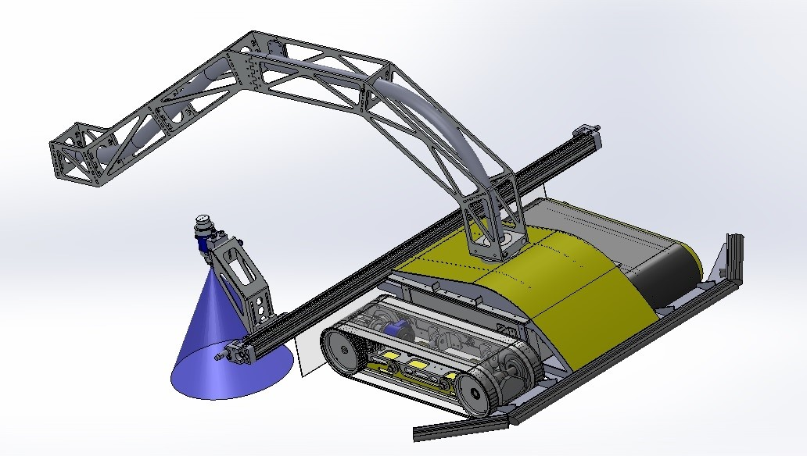
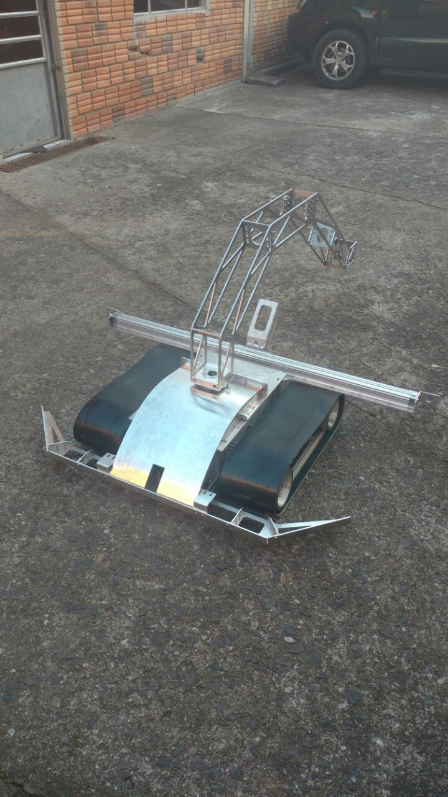
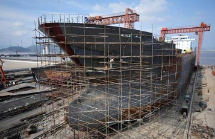
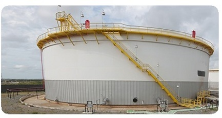
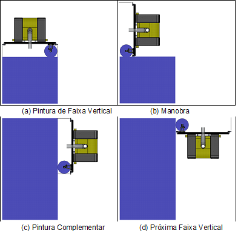
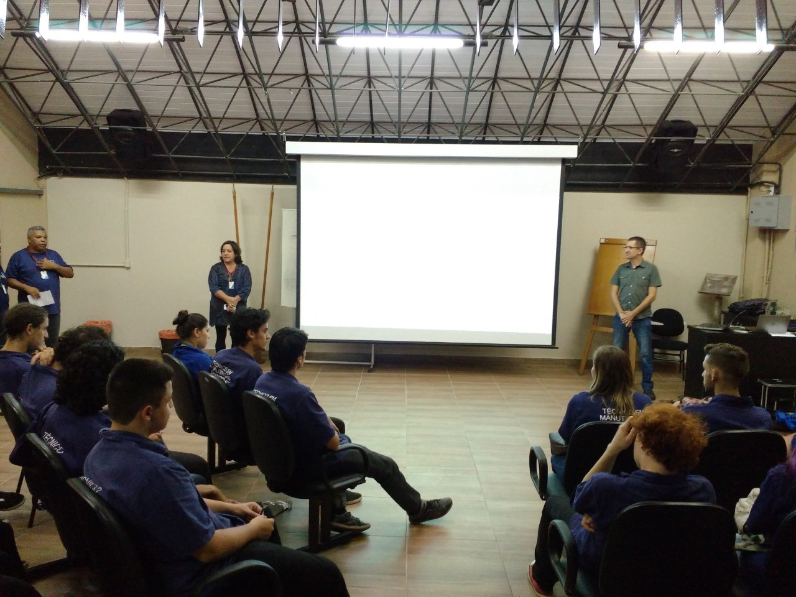
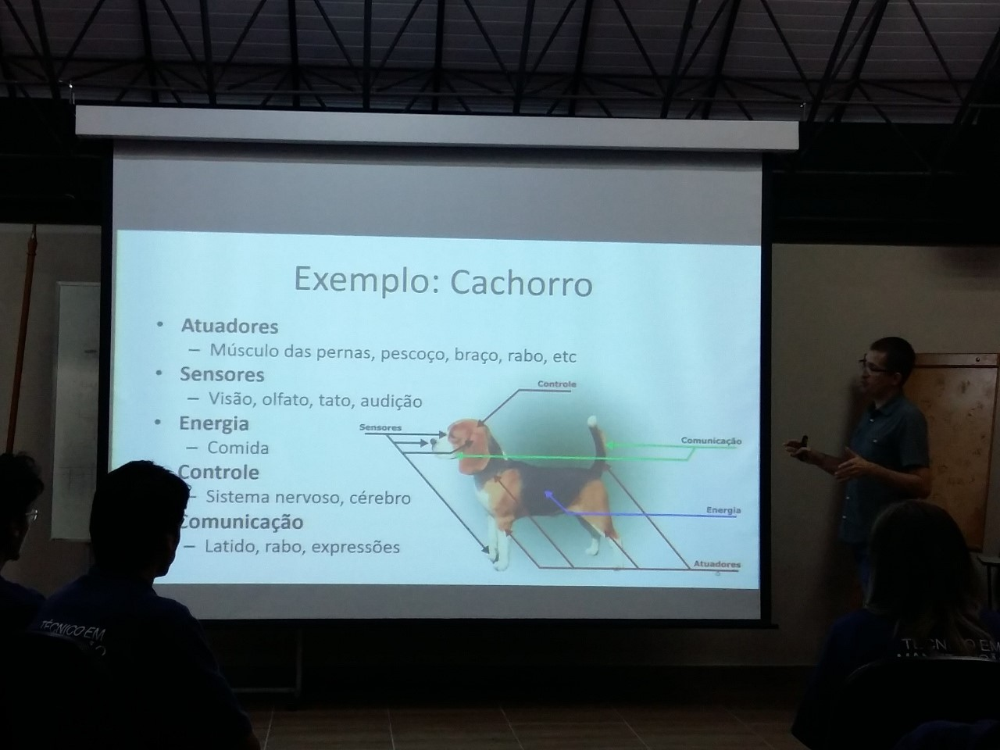
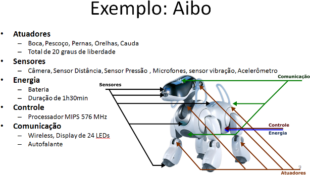
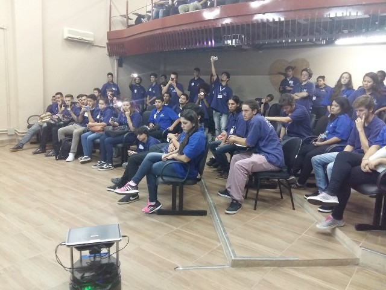

## Project description

Large metal structures such as oil tanks and large ships requires regular mantainance to reduce the effects of corrosion.
Painting is one of the tasks regularly performed to increase the lifespam of these structures.
However, the manual painting process takes a long time. In addition it is unhealthy and unsafe for the worker.

The goal of this project is to design a robot, in cooperation with [Instor](www.instor.com.br) and [UNISC](), and partially funded by [SCIT/RS](www.scit.rs.gov.br).

---

| | | | |
| --- | --- | --- | --- | 
|  |   |   |   |

### Goals

 - Goal 1: build the magnetic tracked robot;
 - Goal 2: design basic control for tele-operation;
 - Goal 3: design simulation model;
 - Goal 4: design robot tracking and autonomous navigation/painting.

### Milestones

 - Milestone 1: specify robot architecture, find and buy robot parts. 100%;
 - Milestone 2: build the custom parts and build the robot hardware. 100%;
 - Milestone 3: design software for tele-operation. 100%;
 - Milestone 4: design driver to interface with Linux computer;
 - Milestone 5: design camera-based robot tracking software. 30%;
 - Milestone 6: design simulation model;
 - Milestone 7: design navigation software and area coverage algorithms. 30%;
 - Milestone 8: integrated test in simulation environment;
 - Milestone 9: integrated test and field tests.
 - Milestone 10: design software to control multiple robots in collaborative tasks;

## People

### Coordinator

 - Alexandre Amory.

### Academic Collaborators

 - prof. [Leonel Tedesco](http://lattes.cnpq.br/2520175088634553), [GPSEM](http://inf.unisc.br/gpsem/), UNISC University;

### Students

 - aluno 1, advised by Alexandre Amory, role: abcd.
 - aluno 2, advised by Alexandre Amory, role: abcd.
 - aluno 3, advised by Leonel Tedesco, role: abcd.
 - aluno 4, advised by Alexandre Amory, role: abcd.
 

## Papers

 - title and link. full bibio data is already available at ...

## Repositories

 - [Painter robot](https://github.com/lsa-pucrs/painter-robot-instor)

## Media 

- Area coverage for the painter robot.

- Class about robotics presented in [Pão dos Pobres](www.paodospobres.org.br/), April, 2016.

